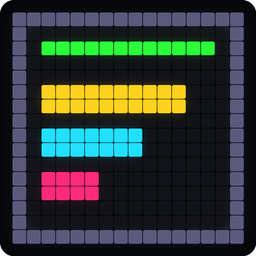

# OSRS Activity

[](https://hacs.xyz/docs/faq/custom_repositories/)
[](https://github.com/Pondake/osrs-activity/actions/workflows/validate.yml)
[](https://my.home-assistant.io/redirect/hacs_repository/?owner=Pondake&repository=osrs-activity&category=integration)

Tracks what an Old School RuneScape player is training and publishes it as
Home Assistant sensors: XP gained this session, XP per hour, which skills are
active, and which attack style you are using in combat.

The [RuneLite integration](https://github.com/db1996/homeassistant_runelite)
gives you a sensor per skill, but those hold a running total. Working out what
you just earned means remembering where the totals were a minute ago, and that
is the part this adds.

A dashboard card and a blueprint for a Divoom Pixoo 64 come with it. Both are
optional, and neither needs its own install.

---

## What you get

One device per player, with seven entities.

| Entity | State | Good for |
|---|---|---|
| `sensor.<player>_xp_session` | how many skills have a live counter | everything — the full picture is in its attributes |
| `sensor.<player>_focus_skill` | `mining`, `slayer`, … | "what am I training" |
| `sensor.<player>_session_xp` | XP gained this sitting | a graph of your evening |
| `sensor.<player>_xp_per_hour` | rate, from the start of the sitting | is this method actually faster |
| `sensor.<player>_combat_style` | `AGGRESSIVE`, `RANGED`, `Slayin'`, … | switching a light when you switch styles |
| `binary_sensor.<player>_idle` | on when you are standing around | a nudge when you have been afk for a while |
| `binary_sensor.<player>_online` | on while the plugin is still pushing | knowing you logged out, without polling |

The XP session sensor is the one to template against. Its attributes carry
`skills` (what is happening now), `window_skills` (everything with a counter
still running), `top`, `combat`, `style`, `slayer_kills`, `total_gained_short`
and the idle state — and every skill row comes with a label that fits in four
characters, a colour, a percentage through the current level, and a path to its
icon.

```jinja
{{ state_attr('sensor.player_xp_session', 'top').gained_short }}   → "12.3k"
{{ state_attr('sensor.player_xp_session', 'style') }}              → "AGGRESSIVE"
{{ state_attr('sensor.player_xp_session', 'skills')
   | map(attribute='label') | join(' ') }}                          → "STR ATT HP"
```

You do not have to touch any of that, though. **A dashboard card comes with the
integration** — it appears in the card picker as *OSRS Activity*, takes one
entity, and shows the same thing the panel does: the skill or the attack style,
what you have gained, a bar per skill in that skill's colour, and the progress
to the next level. It uses the colours the sensor publishes, so the card and
the Pixoo always show a skill in the same colour.

---

## Two windows, two jobs

They were one number at first and it felt sluggish, so they are separate.

**Session window** (minutes, default 5) is how long a skill keeps its counter
after the last gain. Pick the pickaxe back up inside it and `gained` carries on
where it was; come back later and the next gain starts a fresh sitting. It
is also the reset threshold, so "gained" always means the XP of the current
sitting and nothing else.

**Focus window** (seconds, default 25) is a different question: what is
happening *now*. Step off combat onto mining and the combat rows drop out after
this, not after the whole session window. If the focus falls empty during a
short pause, everything inside the session window comes back, so a gap between
actions does not empty the display.

Both are on the integration's options, so you can change them without editing
anything.

---

## Install

Three pieces, in this order: the RuneLite plugin, the RuneLite integration,
then this one. The first two are not mine, and both are a one-off.

### The RuneLite plugin

RuneLite → *Configuration* → **Plugin Hub** → search for **Home Assistant** →
*Install*. It is [db1996/homeassistant](https://github.com/db1996/homeassistant).

In Home Assistant, make a long-lived access token: click your name, bottom
left → *Security* → **Long-lived access tokens** → *Create token*. Copy it
once; it is not shown again.

Back in the plugin's options, fill in your Home Assistant base URL
(`http://homeassistant.local:8123` or whatever yours is) and paste the token.
Then switch on the events you want. **Skill XP is the one this needs** — it is
what makes XP arrive the moment you earn it instead of once per hiscores poll.
Idle detection is optional and drives `binary_sensor.<player>_idle`; its
threshold lives here, in the plugin, not in Home Assistant.

### The RuneLite integration

[`db1996/homeassistant_runelite`](https://github.com/db1996/homeassistant_runelite)
is in the default HACS store, so there is nothing to add by hand: HACS → search
**Runelite** → *Download*. Restart, then add it from *Settings → Devices &
services* and give it your account name.

You should now have a device per player with a sensor per skill. Log in and
train something for a few seconds to check the numbers move. If they do not,
stop here — nothing below can work without them.

### This integration

Four steps. The skill icons and the Pixoo blueprint are handled on first
setup; there is nothing to run afterwards.

**1. Add the repository to HACS.** Click the badge at the top, or by hand:
HACS → the three dots, top right → *Custom repositories* → paste
`https://github.com/Pondake/osrs-activity`, type **Integration** → *Add*.

**2. Download it.** Adding a custom repository only tells HACS that the
repository exists; it does not install anything. Search HACS for **OSRS
Activity**, open it, and press **Download**. This is the step people miss.

**3. Restart Home Assistant.** New integrations are only picked up at startup.
*Settings → System → top right → Restart*.

**4. Add the integration.** *Settings → Devices & services → + Add integration*
→ **OSRS Activity** → pick your player from the dropdown. If that dropdown is
empty, the RuneLite integration above is not set up yet. The two windows have
sensible defaults; [see above](#two-windows-two-jobs) for what they do.

That is the install. You have seven entities under a device named after your
player, the **OSRS Activity** card is in your card picker, and in the
background the integration has fetched the skill icons and put the Pixoo
blueprint into your blueprint folder.

<details>
<summary>What it did in the background</summary>

Fetched the 24 skill icons from the OSRS wiki into
`config/www/osrs_activity/icons/`, normalised onto a 25×25 canvas so a fixed
position on a panel lines up for every skill. Only when that folder is empty,
so a restart is not two dozen requests at a volunteer-run wiki. To fetch them
again — a new skill, or a file you deleted — call
`osrs_activity.download_skill_icons` with `overwrite: true`.

Copied the Pixoo blueprint into `config/blueprints/script/osrs_activity/`. An
existing file is never overwritten, so edits you make survive an update.

Every skill row then carries `icon_path` (a file, for anything using PIL) and
`icon_url` (a `/local/` URL, for the frontend). A skill with no icon resolves
to a transparent square, because a path that does not exist makes the whole
Pixoo page fail to render rather than just the image.
</details>

### If you have a Pixoo 64

*Settings → Automations & scenes → Blueprints* → **OSRS XP on a Pixoo 64** →
*Create script*. It is already in the list; there is no URL to paste. Pick your
panel and your XP session sensor, optionally your health and prayer sensors,
and save.

Then call that script whenever the panel should be redrawn — an automation on
the XP session sensor changing is the obvious one:

```yaml
triggers:
  - trigger: state
    entity_id: sensor.YOUR_PLAYER_xp_session
actions:
  - action: script.YOUR_SCRIPT
mode: queued
max: 2
```

`queued` rather than `single`: `single` drops a trigger that arrives while the
script is still running, which shows up as the panel being a minute behind.
See [docs/pixoo.md](docs/pixoo.md).

<details>
<summary>What the badge does and does not do</summary>

The badge is a [My Home Assistant](https://my.home-assistant.io) link. It works
for custom repositories as well as for ones in the default store — that is what
the `category` parameter in it is for — but all it does is open HACS on your own
instance and offer to add the repository. Downloading, restarting and
configuring are still steps 2 to 4.

On HACS 2.0.5 that confirmation dialog can come up with no text and an
unlabelled button, because HACS asks for it before its own translations have
finished loading. The unlabelled button is *Add*. This happens with any custom
repository and has nothing to do with this one.
</details>

The player list in step 4 comes from the RuneLite integration rather than a text
box on purpose: a typo would silently match no skill sensors at all, and the
result would look like an integration that just does not work.

## The screens

Three screens on a [Divoom Pixoo 64](https://github.com/Faisalthe01/divoom_pixoo),
chosen automatically from what the sensors report:

| When | Screen |
|---|---|
| everything gaining XP is a combat skill | attack style, total gained, rate, HP and prayer bars |
| one skill in focus | that skill, gained, rate, and the bar to the next level |
| anything else | up to five skills, bars scaled against the biggest gainer |

The bars scale against the biggest gainer *inside the focus* rather than
against an absolute figure. That makes a combat sitting read as a ratio
(2:1:1 strength/attack/hitpoints) and makes the same scale work for Wintertodt
and for Zulrah without a special case for either.

Health and prayer are optional inputs; leave them empty and those bars are
simply not drawn. Background and accent are colour pickers.

When nothing is gaining XP the script does nothing and leaves whatever is on
the panel alone, so it can share a Pixoo with your other automations.

> **Before you raise the refresh rate:** [docs/pixoo.md](docs/pixoo.md) has the
> measured limits of the device. Short version — it does not crash under load,
> it *freezes*, and it does so silently: it keeps answering HTTP with
> `error_code: 0` while nothing on screen changes any more. Home Assistant
> cannot see that happen.

---

## Known limits

All three are limits of what the RuneLite plugin sends, not of what this does
with it.

**Idle only clears on your next XP drop.** The plugin sends an idle event but
has no "active again" counterpart, so a gain is the only thing that can clear
it. On a slow skill that can take a while. A PR for the missing event is open
upstream; when it lands the change here is one more event listener.

**Slayer kills are derived, not read.** Slayer XP arrives in a fixed amount per
kill, so a run of equal chunks counts kills. The moment one differs — a
barrage, a mixed task, a kill that lands together with something else — the
division stops meaning anything and the count is hidden rather than shown
wrong. A task name and a real counter need the plugin to send them, which is
also a PR away. Worth keeping the derivation as a fallback either way: it works
on tasks the plugin knows nothing about.

**The idle event has no payload,** so with two accounts logged in there is no
telling which one went idle. Fine as long as only one plays at a time; fixable
only on the plugin side.

---

## Credit

Built on [**db1996/homeassistant_runelite**](https://github.com/db1996/homeassistant_runelite)
and its RuneLite plugin, which do all the talking to the game.

Pixoo drawing goes through
[**Faisalthe01/divoom_pixoo**](https://github.com/Faisalthe01/divoom_pixoo).

Icons are from the [OSRS Wiki](https://oldschool.runescape.wiki), used under
their licence. Old School RuneScape is a trademark of Jagex Ltd; this is an
unofficial hobby project and is not affiliated with or endorsed by Jagex.

MIT licensed.
